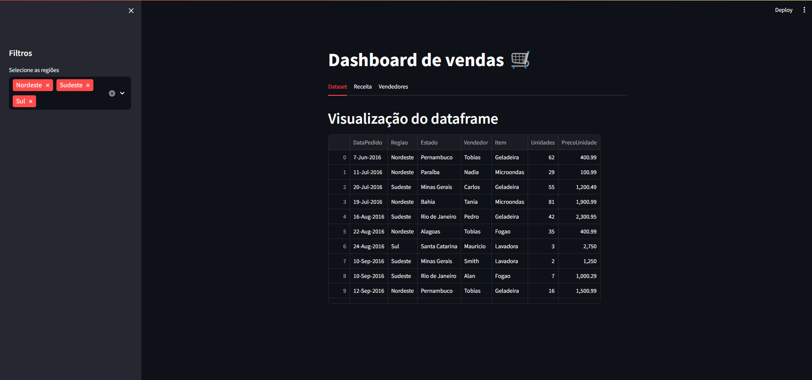
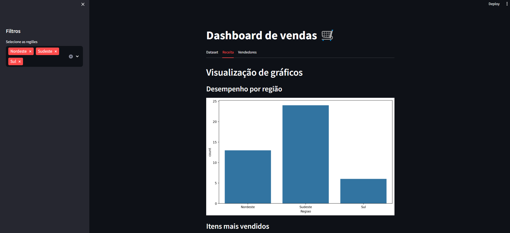
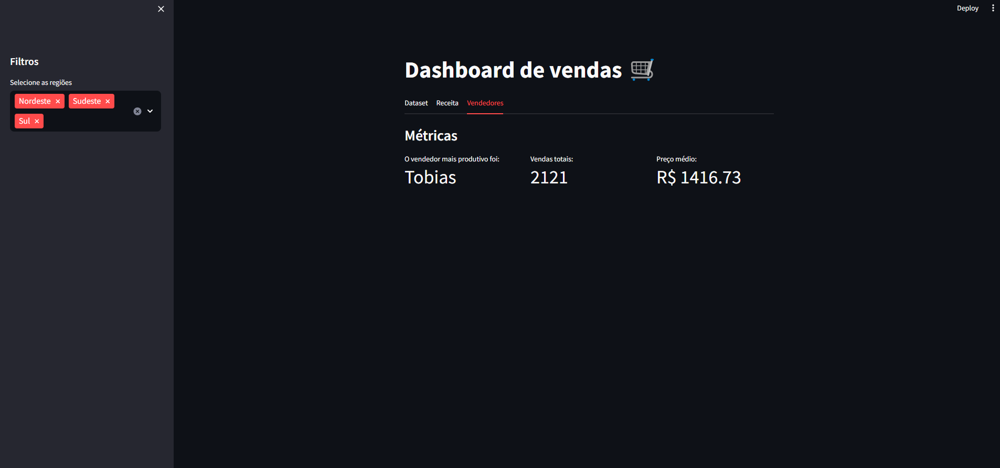

# Dashboard de Vendas





Este projeto é um **Dashboard de Vendas** desenvolvido com **Streamlit** e **Python**. Utiliza dados fictícios de vendas para gerar visualizações interativas e métricas. O dashboard permite que os usuários filtrem as vendas por região e explorem informações como desempenho de vendas, itens mais vendidos e os vendedores mais produtivos.

## Funcionalidades:
- Filtro por região para segmentar os dados
- Visualização de gráficos com o desempenho de vendas por região e itens mais vendidos
- Exibição de métricas como vendedor mais produtivo, total de vendas e preço médio dos produtos

## Estrutura de arquivos:
- `app.py`: código principal da aplicação
- `Pedidos.csv`: dados de vendas
- `requirements.txt`: dependências necessárias para rodar a aplicação

## Como testar:
1. Navegue até a pasta do projeto:
    ```bash
    cd c:/caminho/do/diretorio
    ```
2. Execute o comando para iniciar o Streamlit:
    ```bash
    streamlit run app.py
    ```

O dashboard será aberto automaticamente em seu navegador para visualização e interação com os dados.
